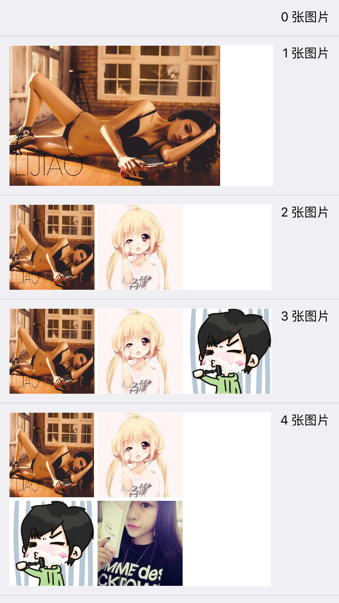
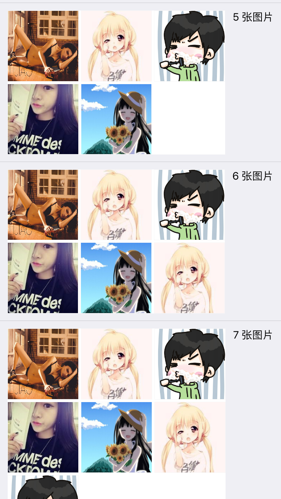

# JWZSudokuView
非常轻量级的类，实现类似微博空间朋友圈的田字格、九宫格图片排列视图，需要SDWebImage组件支持。


## 如何使用

- 1，下载本 Demo 后，将工程目录里的 JWZSudokuView 拖入现有工程。
- 2，JWZSudokuView 需要 SDWebImage 组件支持，如果你的工程没有引入该组件，请引入该组件。Demo 中已提供了一个版本，但可能不是最新的。
- 3，引入头文件 JWZSudokuView.h 然后你就可以使用了。

## Demo截图




#### 在普通布局中使用

```objective-c

#import "JWZSudokuView.h"

NSArray *imageUrls; // 一个数组，存的是图片的链接
UIView *superView;

JWZSudokuView *sudokuView = [[JWZSudokuView alloc] init];
// 你需要给 JWZSudokuView 指定一个宽度
sudokuView.frame = CGRectMake(10, 40, 200, 0);
[sudokuView setContentWithImageUrls:imageUrls];
[superView addSubview:sudokuView];

// 如果你有另外一个视图，在 sodukuView 的下方，那么处理方法就类似如：（其它情况以此类推）
CGFloat height = [JWZSudokuView heightForContentImageCount:imageUrls.count 
                                                totalWidth:200 
                                                 separator:2];
UIView *nextView = [[UIView alloc] init];
nextView.frame = CGRectMake(CGRectGetMinX(sudokuView.frame), 
                            CGRectGetMaxY(sudokuView.frame) + height, 
                            CGRectGetWidth(sudokuView.frame), 
                            CGRectGetHeight(sudokuView.frame));
[superView addSubview:nextView];

```

#### AutoLayout 布局使用

```objective-c
#import "JWZSudokuView.h"

NSArray *imageUrls;
UIView *superView;

JWZSudokuView *sudokuView = [[JWZSudokuView alloc] init];
[superView addSubview:sudokuView];

sudokuView.translatesAutoresizingMaskIntoConstraints = NO;
NSArray *constraints1 = [NSLayoutConstraint constraintsWithVisualFormat:@"H:|[sudokuView]|" 
                                                                options:(NSLayoutFormatAlignAllLeft) 
                                                                metrics:nil 
                                                                  views:NSDictionaryOfVariableBindings(sudokuView)];
[superView addConstraints:constraints1];

// 你不需要制定 sudokuView 的高度约束和底边约束，因为它会自动扩大；如果是 xib ，设置 placeholder 的即可
NSArray *constraints2 = [NSLayoutConstraint constraintsWithVisualFormat:@"V:|[sudokuView]" 
                                                                options:(NSLayoutFormatAlignAllLeft) 
                                                                metrics:nil 
                                                                  views:NSDictionaryOfVariableBindings(sudokuView)];
[superView addConstraints:constraints2];

[sudokuView setContentWithImageUrls:imageUrls];

```

#### 其它说明

- 你需要做的仅仅就是上面这些，就可以轻松实现一个九宫格图片布局。
- 鉴于 SDWebImage 已经非常常用，除此以外整个类都非常简单，非常轻量级。
- 而且其中逻辑也不是很复杂，如果你想自定义样式，可以轻松地修改源代码实现。
- 另外，为了优化在 UITableViewCell 中的使用，JWZSudokuView 使用了重用机制，避免重复创建 UIImageView。
- 重用池只会在重用的时候创建，并不会增加普通使用时的资源开销。
- 重用机制可能会让内存吃紧，实际上影响很小，即便如此 JWZSudokuView 也做了相关的优化。
- 当收到内存警告时，JWZSudokuView 将销毁重用池以及重用池里的对象。

